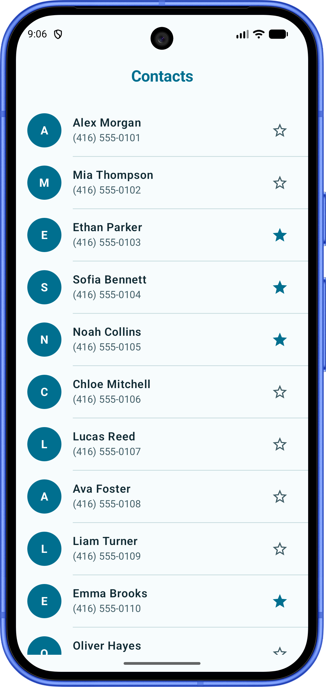

# Compose UI Challenge Lab

Build Jetpack Compose screens one small challenge at a time.

The data layer is already wired: models, mock data, repositories, themes, assets, and app setup are ready. Your job is the UI. You do not need to memorize every Compose API, but writing the screen yourself once is a great way to make the magic less mysterious. Vibe coding can be your co-pilot; it should not be the only one who knows where the brakes are.

There are two branches:

- `exercise` — the UI starting point
- `solution` — the completed reference implementation

## Level 1 — Foundation

Four focused screens, in a deliberately sensible order:

### 1. Contact List

Build a clean, scrollable contact directory with reusable rows, stable keys, and favorite actions.

### 2. Compose Market

Compose a colorful product grid with real product imagery, ratings, discounts, prices, and favorite states.

<video src="market.mp4" controls width="320"></video>

### 3. Recipe

Build a recipe search screen with category chips, derived filtering, rich cards, remote images, and favorite actions.

<video src="recipe.mp4" controls width="320"></video>

### 4. Settings

Organize switches, checkboxes, radio choices, theme selection, and text-size controls into a polished settings screen.

<video src="settings.mp4" controls width="320"></video>

## A small rule

Pick a project, build the screen, and peek at `solution` when you get stuck. Let AI help with the boring parts, then read the result and make it yours. Compose becomes much less intimidating after you have typed it with your own keyboard.
