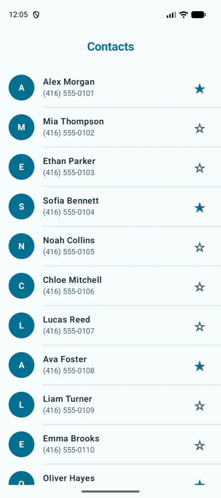
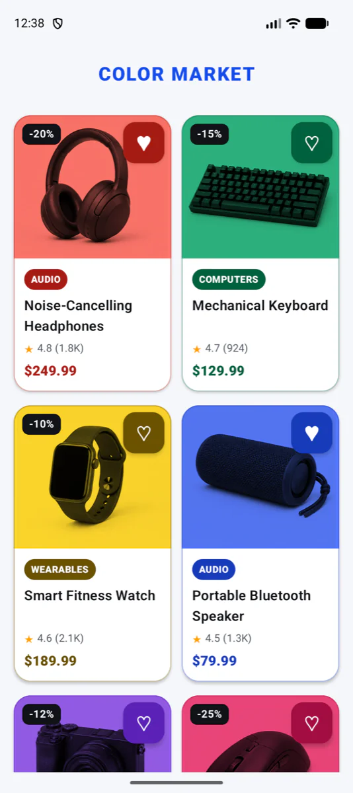
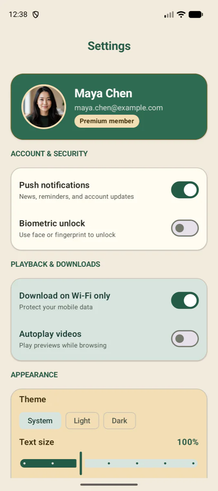
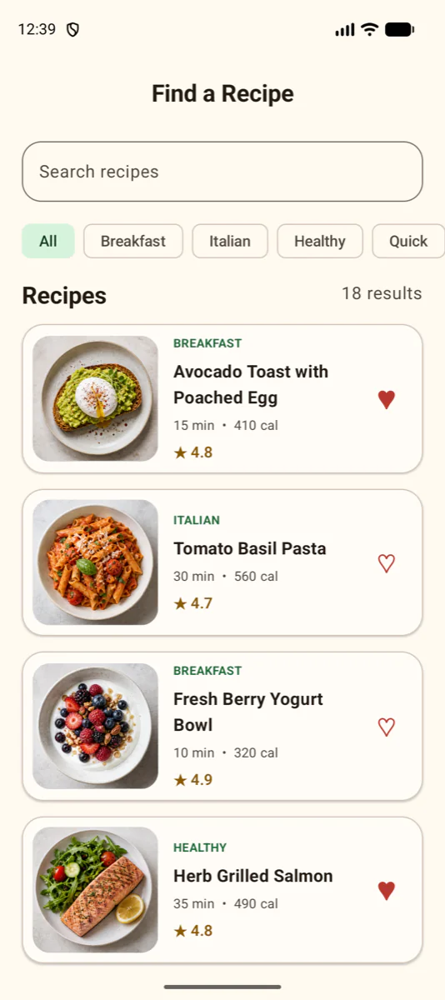
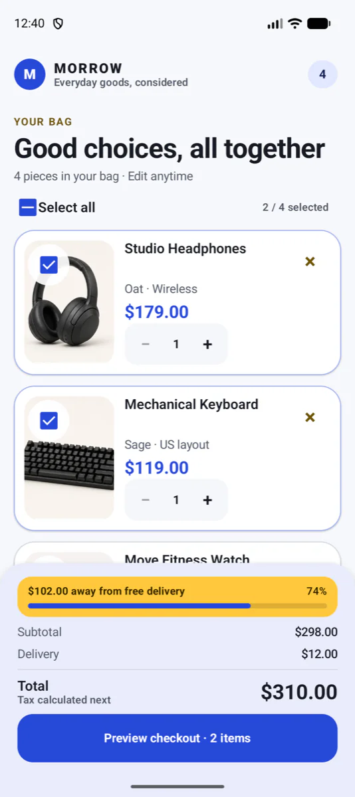
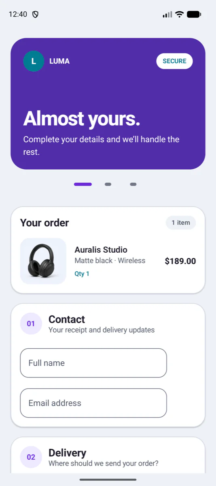
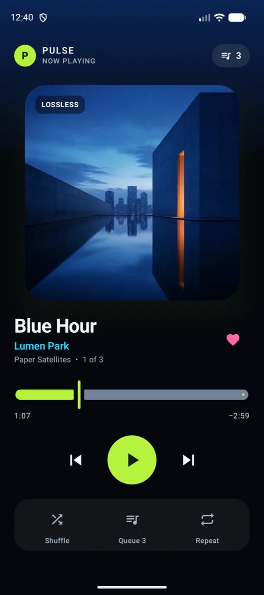
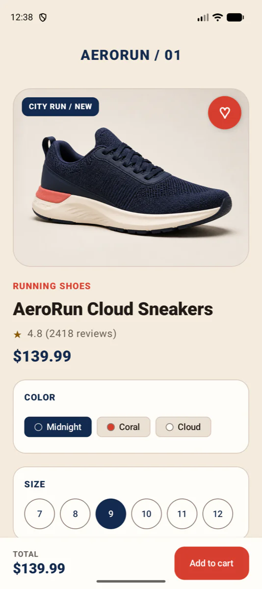

# Compose UI Challenge Lab

Learn Jetpack Compose by completing one focused, single-screen challenge at a time.

Every challenge already includes the Android project structure, models, mock data, in-memory repository, theme, assets, and app wiring. The unfinished branch keeps the work centered on the Compose UI, so you can start building immediately without first creating infrastructure or connecting a server.

This makes the lab approachable for someone meeting Compose for the first time while still offering polished screens, realistic data, and increasingly complex state problems.

> This lab is continuously updated with new challenges and levels.

## Two-Branch Workflow

The starter and completed versions are not duplicated into separate folders. The same challenge folders exist on two Git branches.

| Branch | What it contains | When to use it |
| --- | --- | --- |
| `exercise` | Project setup, models, mock data, repositories, themes, assets, and small compile-ready Screen and ViewModel starting points | Build the Compose UI yourself |
| `solution` | The completed UI, ViewModel, state handling, and interactions | Review or compare the finished implementation |

### Recommended Flow

1. Start from the unfinished branch.

   ```bash
   git checkout exercise
   ```

2. Open one challenge folder as an independent Android Studio project.
3. Build the screen and commit your work on `exercise`.
4. Switch to the completed branch when you want to inspect the reference implementation.

   ```bash
   git checkout solution
   ```

5. Return to `exercise` to continue your own implementation.

   ```bash
   git checkout exercise
   ```

### Important Branch Behavior

- A branch belongs to the entire repository, not to one challenge folder.
- Switching to `solution` changes every challenge to its completed version at once.
- Switching to `exercise` changes every challenge back to its starting version at once.
- Commit or stash your changes before switching branches.
- Push both branches separately the first time:

  ```bash
  git push -u origin exercise
  git push -u origin solution
  ```

## Level 1 · Foundation

Build confidence with Compose layout, reusable components, lists, grids, controls, imagery, and visual hierarchy. The active path contains four focused challenges.

<table>
  <tr>
    <td width="34%" align="center"></td>
    <td width="66%" valign="top">
      <h3>01 · Contact List</h3>
      <p>Build a clean, scrollable directory with reusable contact rows.</p>
      <strong>Challenge focus</strong>
      <ul>
        <li><code>LazyColumn</code>, stable keys, and dividers</li>
        <li>Reusable row composables and list item layout</li>
        <li>Theme color roles and state-driven favorite icons</li>
      </ul>
      <a href="level-01-foundation/01-contact-list">Open challenge</a>
    </td>
  </tr>
  <tr>
    <td width="34%" align="center"></td>
    <td width="66%" valign="top">
      <h3>02 · Product Grid</h3>
      <p>Compose a colorful two-column catalog using real product imagery.</p>
      <strong>Challenge focus</strong>
      <ul>
        <li><code>LazyVerticalGrid</code> and card composition</li>
        <li>Image sizing, cropping, badges, and overlays</li>
        <li>Ratings, discounts, prices, and favorite states</li>
      </ul>
      <a href="level-01-foundation/02-product-grid">Open challenge</a>
    </td>
  </tr>
  <tr>
    <td width="34%" align="center"></td>
    <td width="66%" valign="top">
      <h3>04 · Settings</h3>
      <p>Organize a settings screen with distinct sections and Material controls.</p>
      <strong>Challenge focus</strong>
      <ul>
        <li><code>Switch</code>, <code>Checkbox</code>, radio choices, and slider composition</li>
        <li>Grouped settings rows and mixed surface styles</li>
        <li>Callbacks and state-driven control values</li>
      </ul>
      <a href="level-01-foundation/04-settings">Open challenge</a>
    </td>
  </tr>
  <tr>
    <td width="34%" align="center"></td>
    <td width="66%" valign="top">
      <h3>05 · Search and Filter</h3>
      <p>Build a recipe search experience with category filters and image-led results.</p>
      <strong>Challenge focus</strong>
      <ul>
        <li>Search input and horizontally scrolling filters</li>
        <li>Derived filtered results and empty states</li>
        <li>Rich list cards with photography and metadata</li>
      </ul>
      <a href="level-01-foundation/05-search-and-filter">Open challenge</a>
    </td>
  </tr>
</table>

[Explore Level 1](level-01-foundation)

## Level 2 · State and Input

Move beyond static layouts into derived state, events, validated input, gestures, and time-based UI.

<table>
  <tr>
    <td width="34%" align="center"></td>
    <td width="66%" valign="top">
      <h3>01 · Shopping Cart</h3>
      <p>Coordinate selection, quantity changes, removal, restoration, and calculated totals.</p>
      <strong>Challenge focus</strong>
      <ul>
        <li>Derived UI state and quantity boundaries</li>
        <li>List item events and one-shot Snackbar events</li>
        <li>Edge-to-edge content with a persistent summary action</li>
      </ul>
      <a href="level-02-state-and-input/01-shopping-cart">Open challenge</a>
    </td>
  </tr>
  <tr>
    <td width="34%" align="center"></td>
    <td width="66%" valign="top">
      <h3>02 · Checkout Form</h3>
      <p>Build a complete form flow with a swipeable hero, validation, choices, totals, and confirmation.</p>
      <strong>Challenge focus</strong>
      <ul>
        <li>Text input, validation, focus, and IME-safe layout</li>
        <li>Pager gestures and selectable shipping or payment options</li>
        <li>Form-driven state and confirmation dialogs</li>
      </ul>
      <a href="level-02-state-and-input/02-checkout-form">Open challenge</a>
    </td>
  </tr>
  <tr>
    <td width="34%" align="center"></td>
    <td width="66%" valign="top">
      <h3>03 · Media Player</h3>
      <p>Compose a dark, image-led player with seeking, playback modes, and a queue.</p>
      <strong>Challenge focus</strong>
      <ul>
        <li>Time-based state updates and slider seeking</li>
        <li>State-driven shuffle, repeat, and favorite controls</li>
        <li>Modal bottom sheets and accessible media actions</li>
      </ul>
      <a href="level-02-state-and-input/03-media-player">Open challenge</a>
    </td>
  </tr>
  <tr>
    <td width="34%" align="center"></td>
    <td width="66%" valign="top">
      <h3>04 · Product Detail</h3>
      <p>Build a realistic product page with selection controls and a persistent purchase action.</p>
      <strong>Challenge focus</strong>
      <ul>
        <li>Scrollable content with a fixed bottom action area</li>
        <li>Radio-style product choices and quantity controls</li>
        <li>State hoisting and derived purchase state</li>
      </ul>
      <a href="level-02-state-and-input/04-product-detail">Open challenge</a>
    </td>
  </tr>
</table>

[Explore Level 2](level-02-state-and-input)

## What Every Challenge Includes

- One independent Android project per folder
- One focused screen per project
- Jetpack Compose with Material 3
- MVVM and unidirectional data flow
- Models, realistic mock data, and in-memory repositories
- Themes and image assets ready to use
- No Hilt, Room, Navigation, database, or server setup

The structure is ready. Pick a challenge, open the `exercise` branch, and focus on Compose.
