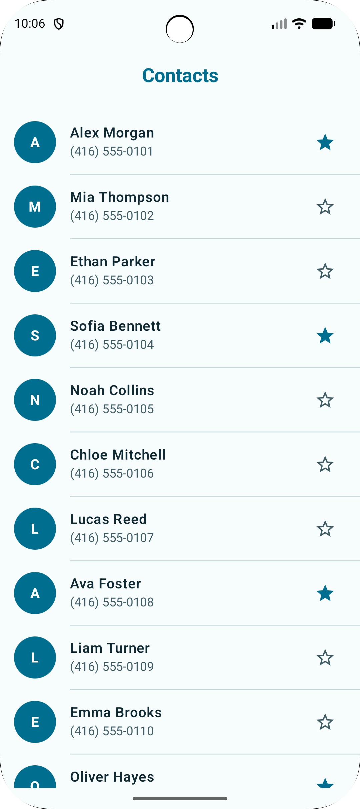
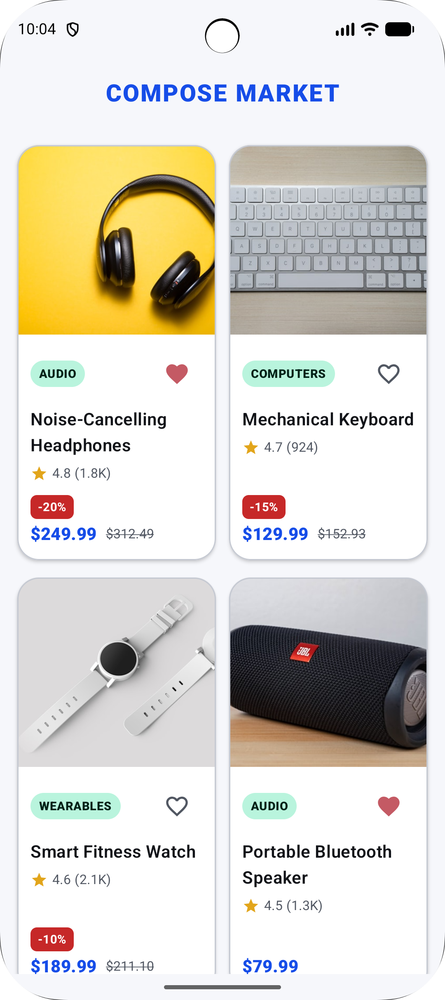
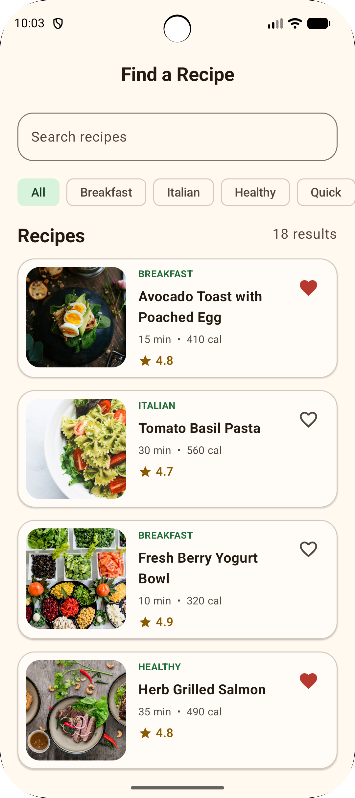
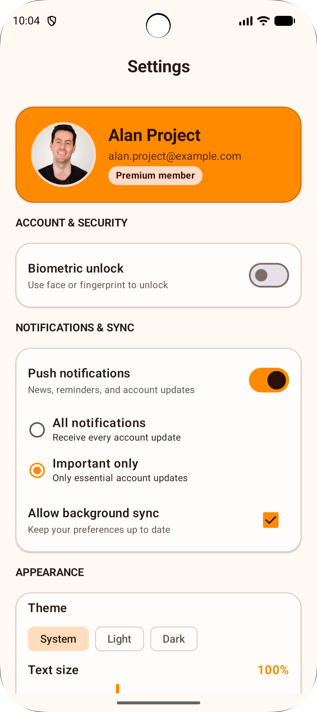
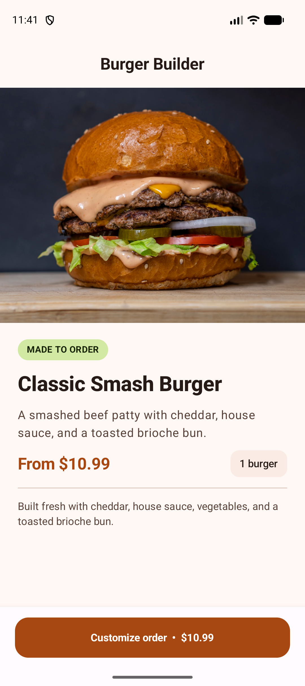

# Compose UI Challenge Lab

Build Jetpack Compose screens one small challenge at a time.

The data layer is already wired: models, mock data, repositories, themes, assets, and app setup are ready. Your job is the UI. Vibe coding can make a screen appear quickly, but it cannot make you understand what you built. Try each challenge once yourself—the extra typing is where Compose starts to make sense.

The solution is not the only right answer. Use it as a reference, then build each screen in your own way.

There are two branches:

- `exercise` — the UI starting point
- `solution` — the completed reference implementation

## Level 1 — Foundation

Four focused screens, in a deliberately sensible order:

<table>
<tr>
<td width="42%" valign="top" align="center">

</td>
<td width="58%" valign="top">
<h3>1. Contact List</h3>

Build a clean, scrollable contact directory with reusable rows, stable keys, and favorite actions.

<strong>What you’ll practice</strong>
<ul>
<li><code>LazyColumn</code> and stable item keys</li>
<li>Reusable row composables and list spacing</li>
<li>State-driven favorite actions</li>
</ul>
<a href="level-01-foundation/contact-list">Open challenge</a>
</td>
</tr>
<tr>
<td width="42%" valign="top" align="center">

</td>
<td width="58%" valign="top">
<h3>2. Compose Market</h3>

Compose a colorful product grid with real product imagery, ratings, discounts, prices, and favorite states.

<strong>What you’ll practice</strong>
<ul>
<li><code>LazyVerticalGrid</code> and card composition</li>
<li>Image cropping, badges, and overlays</li>
<li>Ratings, discounts, prices, and favorites</li>
</ul>
<a href="level-01-foundation/compose-market">Open challenge</a>
</td>
</tr>
<tr>
<td width="42%" valign="top" align="center">

</td>
<td width="58%" valign="top">
<h3>3. Recipe</h3>

Build a recipe search screen with category chips, derived filtering, rich cards, remote images, and favorite actions.

<strong>What you’ll practice</strong>
<ul>
<li><code>LazyRow</code> and <code>FilterChip</code></li>
<li>Search and category filtering with <code>Flow</code>/<code>StateFlow</code></li>
<li>Remote images and rich list cards</li>
</ul>
<a href="level-01-foundation/recipe">Open challenge</a>
</td>
</tr>
<tr>
<td width="42%" valign="top" align="center">

</td>
<td width="58%" valign="top">
<h3>4. Settings</h3>

Organize switches, checkboxes, radio choices, theme selection, and text-size controls into a polished settings screen.

<strong>What you’ll practice</strong>
<ul>
<li>Switches, checkboxes, radio buttons, and sliders</li>
<li>Grouped sections and reusable setting rows</li>
<li>State hoisting and event callbacks</li>
</ul>
<a href="level-01-foundation/settings">Open challenge</a>
</td>
</tr>
</table>

## Level 2 — State & Input

The screen can look good. Now it also has to remember what the user did.

<table>
<tr>
<td width="42%" valign="top" align="center">

</td>
<td width="58%" valign="top">
<h3>1. Burger Builder</h3>

Build a realistic food-order flow for choosing a patty, vegetables, extras, quantity, and special instructions.

<strong>What you’ll practice</strong>
<ul>
<li><code>rememberSaveable</code> for in-progress choices and text input</li>
<li><code>ModalBottomSheet</code> with state hoisted above dismissible content</li>
</ul>
<a href="level-02-state-and-input/burger-builder">Open challenge</a>
</td>
</tr>
</table>
